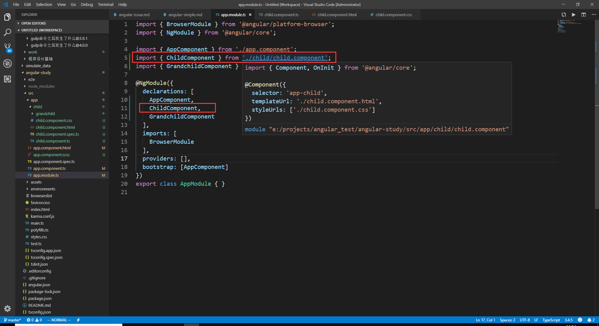
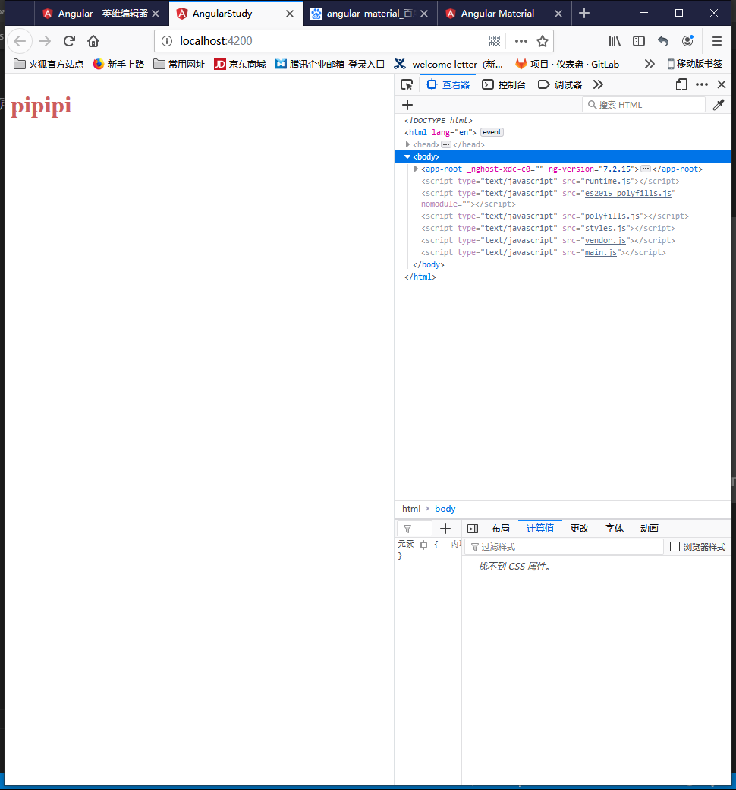
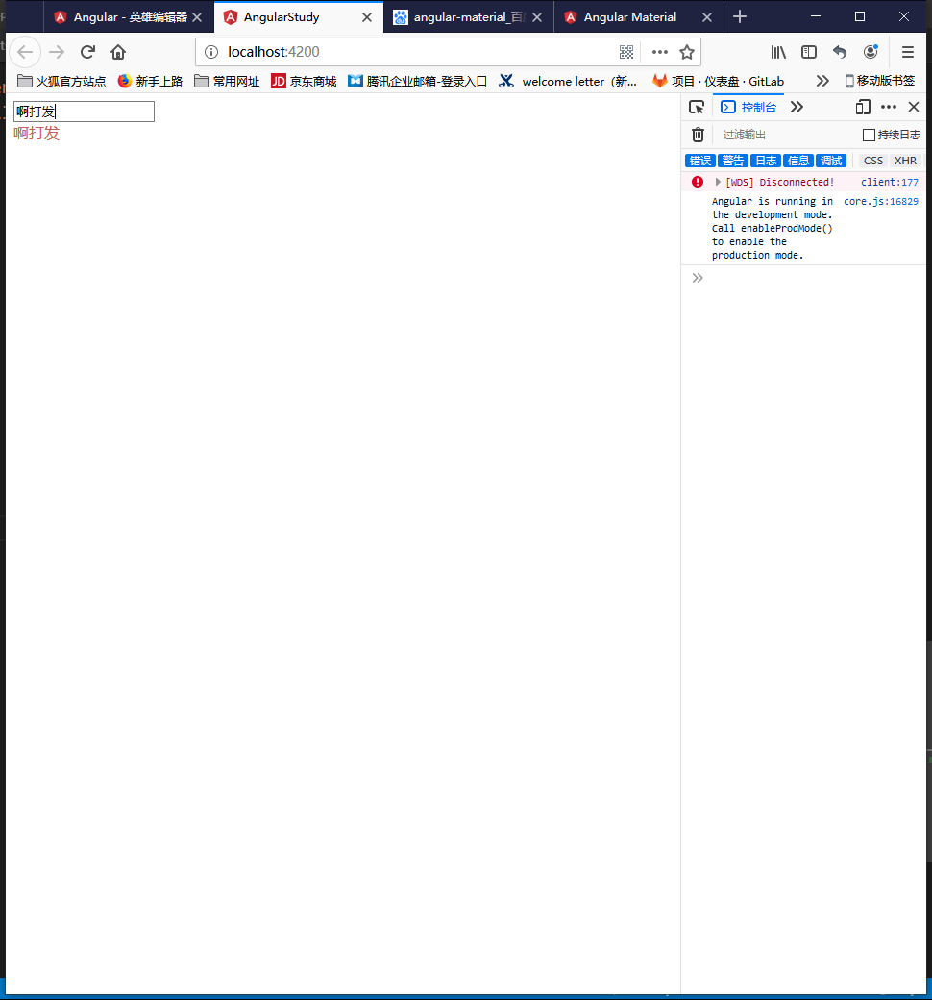
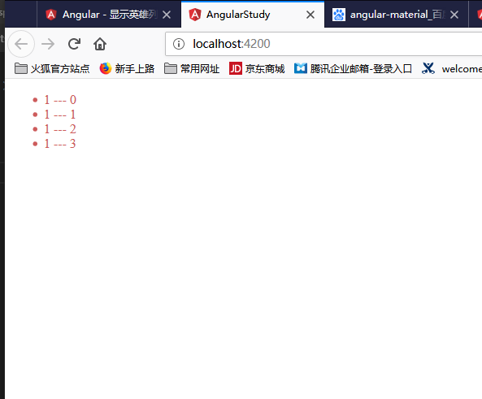
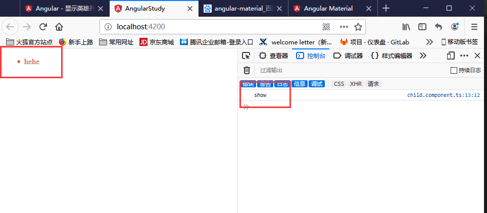
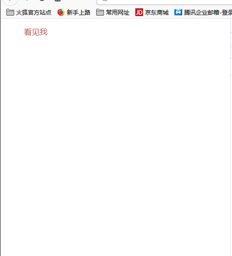
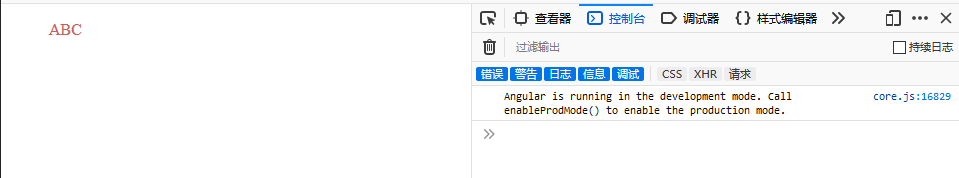

# angular入门练习随记

- ## 安装`angular-cli`

  在使用angular之前，必须全局安装`angular-cli`，使用命令 `npm i -g @angular/cli`

- ## 安装简单的`angular`程序，并且启动

  使用`ng new [project-name]`, `ng serve -o`; `-o`表示自动在浏览器中打开页面; 可以使用 `ng generate component [component-name]` 来新建组件。使用该命令来新建组件会自动在app-module中注册该组件，也会默认创建4个文件(除了module文件)，如下所述。  
  

- ## 简单介绍

  在angular目录下的 `src/app/`下默认会生成 5个文件

  - app.component.html 这个页面包含html代码，是整个模块的视图层
  - app.component.css  这个文件包含管理该模块的css
  - app.component.ts   这个文件是相当于整个模块的controller，链接着视图层和数据层，包含着页面显示数据的逻辑代码
  - app.component.spec.ts  **这个还不知道是什么**
  - app.component.module.ts 这个文件是整个模块的入口文件(在我看来)，整个模块的引用依赖都在这个文件中完成

- ## angular常规使用
  
  - **向html注入自定义变量**  
  使用 `{{ param }}` 向 .html文件注入变量，变量的声明在 .component.ts文件中;下面例子创建一个新组建child，并在app组件中引入child从而显示child组件的内容。

  ```html
    <!-- app.component.html -->
    <app-child></app-child>
  ```

  ```html
    <!-- child.component.html -->
    <div> {{ show }} </div>
  ```

  ```css
    div{
        color: indianred;
    }
  ```

  ```typeScript
    // child.component.ts
    import { Component, OnInit } from '@angular/core';

    //@Component是一个装饰函数，用于为该组件指定数据元
    @Component({
        selector: 'app-child', //在其他html页面引用时，所写的标签
        templateUrl: './child.component.html', //自己的html代码url
        styleUrls: ['./child.component.css'] //引入的css的url
    })

    //导出这个类
    export class ChildComponent implements OnInit {

    constructor() { }
        //该组件的生命钩子，在组件创建之前执行
        ngOnInit() {}
        show = 'pipipi';
    }
  ```

  显示效果如下图:  
  

  ---

  - **双向绑定变量**
  使用 `[(ngModel)]` 来给变量进行双向绑定。**注意！使用 `[(ngModel)]`必须引入模块`FormsModule`，并且在写入`imports`**

  ```html
    <!-- child.component.html -->
    <input [(ngModel)] = 'connect'/>
    <div> {{ connect }} </div>
  ```

  ```typeScript
    // child.component.ts
    export class ChildComponent implements OnInit {
    constructor() { }
        ngOnInit() {}
        connect = '';
    }
  ```

  ```typeScript
    // app.module.ts
    import { BrowserModule } from '@angular/platform-browser';
    import { NgModule } from '@angular/core';
    import { FormsModule } from '@angular/forms';

    import { AppComponent } from './app.component';
    import { ChildComponent } from './child/child.component';

    @NgModule({
      declarations: [
        AppComponent,
        ChildComponent,
      ],
      imports: [
        BrowserModule,
        FormsModule
      ],
      providers: [],
      bootstrap: [AppComponent]
    })
    export class AppModule { }
  ```

  显示效果如下图:

  ---

  - **循环**

  ```html
    <!-- child.component.html -->
    <!-- 
      items = [{name:1},{name:1},{name:1},{name:1}]
     -->
    <ul>
      <li *ngFor = "let item of items; let i = index">
        {{ item.name }} --- {{ i }}
      </li>
    </ul>
  ```

  显示效果如下图:

  ---

  - **添加事件**

  ```html
    <!-- child.component.html -->
    <ul>
      <li (click)="show()">
        hehe
      </li>
    </ul>
  ```

  ```typeScript
    // child.component.ts
    export class ChildComponent implements OnInit {
    constructor() { }
        ngOnInit() {}
        show() {
          console.log('show');
        }
    }
  ```

  显示效果如下图:

  ---

  - **判断**

  ```html
    <!-- child.component.html -->
    <div *ngIf="false">看不见我</div>
    <div *ngIf="true">看见我</div>
  ```

  显示效果如下图:

  ---
  
  - **管道**

  ```html
    <!-- child.component.html -->
    <div>{{'abc' | uppercase}}</div>
  ```

  显示效果如下图:

