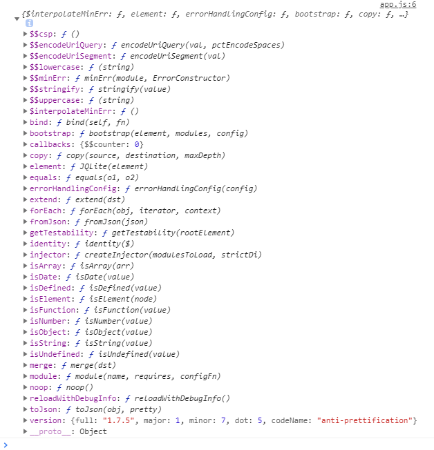
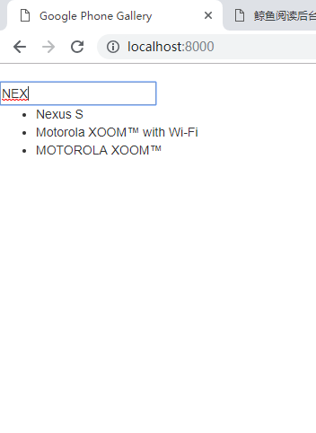

# 简单学习AngularJS


## 学习步骤

- 克隆仓库

    `git clone --depth=14 https://github.com/angular/angular-phonecat.git`

- 安装依赖项

    `npm install`

- 将项目退回到版本 step-1，step-1是提交的每个版本的标签，用于保证在练习每个阶段的过程中有一个干净的初始化环境

    `git checkout -f step-1`

- 启动项目

    `npm start`

- 可以看到项目的app目录很简单

    

    打开index.html有如下代码

    ```html
    <!DOCTYPE html>
    <!-- ng-app 告诉 angularJS哪个部分由其控制，这里在html标签中，表示整个html页面。如果对ng-app进行赋值操作，则表示为其指定载入哪个模块；比如ng-app='phonecatApp';表示在此页面中载入phonecatApp Module-->
    <html lang="en" ng-app>
    <head>
        <meta charset="utf-8">
        <title>Google Phone Gallery</title>
        <link rel="stylesheet" href="lib/bootstrap/dist/css/bootstrap.css" />
        <link rel="stylesheet" href="app.css" />
        <!-- 引入angularJS文件 -->
        <script src="lib/angular/angular.js"></script>
    </head>
    <body>

        <ul>
        <li>
            <span>.....</span>
        </li>
        </ul>

    </body>
    </html>
    ```

- angularJS大概的项目脉络

  由于angularJS是一个标准的MVC框架，所以由三个部分组成，module、view、controller。但是在angularJS中也由组件的概念。

  其中module的声明方法是 `angular.module('[module-name]', [])`；使用 `ng-app` 来为html选择注入哪个模块(可以写在html标签中或者局部标签如div中)。

  controller的声明方法是 `angular.module('[module-name]', []).controller('[controller-name]', fn)`，其中fn包含一个参数 `$scope`；使用 `ng-controller` 来为html选择注入哪个控制器(可以写在body标签)。他会把 `$scope`所携带的信息注入到html中。

  ```javascript
    //app.js

    'use strict';
    // Define the `phonecatApp` module
    var phonecatApp = angular.module('phonecatApp', []);

    // Define the `PhoneListController` controller on the `phonecatApp` module
    phonecatApp.controller('PhoneListController', function PhoneListController($scope) {
        $scope.phones = [
            {
            name: 'Nexus S',
            snippet: 'Fast just got faster with Nexus S.'
            }, {
            name: 'Motorola XOOM™ with Wi-Fi',
            snippet: 'The Next, Next Generation tablet.'
            }, {
            name: 'MOTOROLA XOOM™',
            snippet: 'The Next, Next Generation tablet.'
            }
        ];
    });
  ```

  view就是html页面，通过 `ng-app` 和 `ng-controller`来设置控制器和模块。

  ```html
  <!DOCTYPE html>
    <html lang="en" ng-app="phonecatApp">
    <head>
        <meta charset="utf-8">
        <title>Google Phone Gallery</title>
        <link rel="stylesheet" href="lib/bootstrap/dist/css/bootstrap.css" />
        <link rel="stylesheet" href="app.css" />
        <script src="lib/angular/angular.js"></script>
        <script src="app.js"></script>
    </head>
    <body ng-controller="PhoneListController">

        <ul>
        <li ng-repeat="phone in phones">
            <span>{{phone.name}}</span>
            <p>{{phone.snippet}}</p>
        </li>
        </ul>

    </body>
    </html>
  ```

  **初始的angular会主动打开index.html文件同时去加载app.js文件。说是由bootstrap来控制引导应用程序。但具体还不知道怎么设置**

  当注册完 module；也就是执行`var phonecatApp = angular.module('phonecatApp', []);`；这里 `phonecatApp` 返回的是一个object。打印其可以看到他的键值对。

  

  下图是打印angular对象

  

- 组件

  从上图中注册完module后所返回的object中，包含component键值对。可以通过module所返回的对象设置其模块下的component。
  可以看到函数是 `controller: ƒ (recipeName, factoryFunction)`;

  ```js
    angular.module('phonecatApp').component('phoneList',{
        template: `
        {{ $ctrl }}
            <ul>
            <li ng-repeat="phone in $ctrl.phones">
                <span>{{phone.name}}</span>
                <p>{{phone.snippet}}</p>
            </li>
            </ul>`,
        controller:function(){
            console.log(this);
            this.phones = [
                {
                name: 'Nexus S',
                snippet: 'Fast just got faster with Nexus S.'
                }, {
                name: 'Motorola XOOM™ with Wi-Fi',
                snippet: 'The Next, Next Generation tablet.'
                }, {
                name: 'MOTOROLA XOOM™',
                snippet: 'The Next, Next Generation tablet.'
                }
            ]
        }
    })
  ```

  在上面中可以在模板中通过 $ctrl 访问controller，而controller中的this代表controller本身(object)。

  

  也可以在通过绑定一个input的value来过滤list的显示

    ```js
    angular.module('phonecatApp').component('phoneList',{
        template: `
            <input ng-model='keyword'/>
            <ul>
            <li ng-repeat="phone in $ctrl.phones | filter:keyword">
                <span>{{phone.name}}</span>
                <p>{{phone.snippet}}</p>
            </li>
            <!-- 管道可以连缀使用，orderBy作用是排序
                <li ng-repeat="phone in $ctrl.phones | filter:keyword | orderBy:name">
                    <span>{{phone.name}}</span>
                    <p>{{phone.snippet}}</p>
                </li> 
             -->
            </ul>`,
        controller:function(){
            console.log(this);
            this.phones = [
                {
                name: 'Nexus S',
                snippet: 'Fast just got faster with Nexus S.'
                }, {
                name: 'Motorola XOOM™ with Wi-Fi',
                snippet: 'The Next, Next Generation tablet.'
                }, {
                name: 'MOTOROLA XOOM™',
                snippet: 'The Next, Next Generation tablet.'
                }
            ]
        }
    })
    ```

    这里的filter会去匹配整个对象而不仅仅是该对象在页面中显示出来的部分。

    

    上图可以看见过滤 *NEX*，list中的li中第二第三个item并没有 *NEX*但是他们没有过滤掉，是因为这里只是显示了phones.name但是phones.snippet没有显示，而phones.snippet却包含 *NEX*，所以他们没有被过滤掉。

    **问题：这里的数据绑定是直接通过ng-model指令执行的，那ng-model这个指令把数据绑定到了哪里**

- 基本语法

  - 在模板中引入变量: `{{ param }}`
  - `ng-repeat` 循环