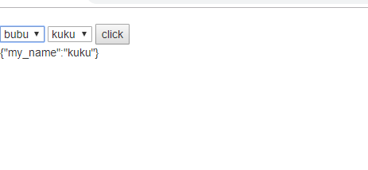
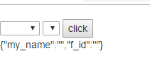
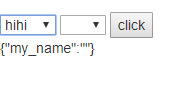
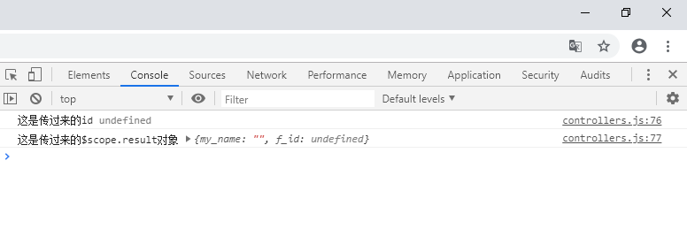
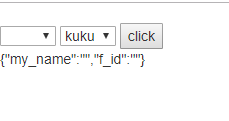
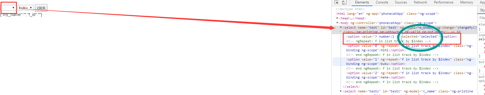

# 在是angularJS 1.xx 中所遇到的问题

## 目录

---

1. 关于select选择框

---

### 关于select选择框

需求：有个一数组，假设是如下所示，希望做一个二级联动选择框，取得子选择框的name，也就是my_name字段.

```json

const list = [
    {
        "id": 1,
        "name": "hihi",
        "child":[
            {
                "f_id":1,
                "my_name": "pipi"
            },
            {
                "f_id":1,
                "my_name": "kiki"
            },
            {
                "f_id":1,
                "my_name": "gigi"
            }
        ]
    },{
        "id": 2,
        "name": "bubu",
        "child":[
            {
                "f_id":2,
                "my_name": "pupu"
            },
            {
                "f_id":2,
                "my_name": "kuku"
            },
            {
                "f_id":2,
                "my_name": "gugu"
            }
        ]
    },{
        "id": 3,
        "name": "hehe",
        "child":[
            {
                "f_id":3,
                "my_name": "pepe"
            },
            {
                "f_id":3,
                "my_name": "keke"
            },
            {
                "f_id":3,
                "my_name": "gege"
            }
        ]
    },
]

```

基本思路： 先做一个二级联动的选择框， 父选择框绑定变量为 **选择项目的索引**存储在变量 s_index中，子选择框根据这个索引找到要 **遍历的目标**遍历存储在变量 c_name中。最后可以获取 c_name，代码如下。

```html
    <select name="test" id="test" ng-model="s_index" ng-change="changeMy()">
      <option value="{{$index}}" ng-repeat="f in list track by $index">{{f.name}}</option>
    </select>

    <select name="testc" id="testc" ng-model="c_name">
      <option value="{{c.my_name}}" ng-repeat="c in list[s_index].child">{{c.my_name}}</option>
    </select>

    <button type="button" ng-click="show()">click</button>
    <div>
      {{result}}
    </div>
```

```js
var phonecatApp = angular.module('phonecatApp', []);

phonecatApp.controller('phonecatApp', function($scope){
    $scope.list = [...];
    $scope.show = show;
    //需求要的东西
    $scope.result = {
        my_name: ""
    }

    $scope.show = show;

    //展示需求要的东西
    function show(){
        $scope.result["my_name"] = $scope.c_name;
    }
```

可以看见轻松的实现了联动并且获取了绑定的值，c_name;  
  

**需求变动**： 我还要获取父选择框的id，即字段 id。

想着这也不难，绑定一个 `change`事件，将id传过去不就好了，然后在处理不就好了。哈哈，少年还是想的太简单了！！改动代码如下:

```html
    <!-- 添加指令changeMy(f.id) -->
    <select name="test" id="test" ng-model="s_index" ng-change="changeMy(f.id)">
      <option value="{{$index}}" ng-repeat="f in list track by $index">{{f.name}}</option>
    </select>

    <select name="testc" id="testc" ng-model="c_name">
      <option value="{{c.my_name}}" ng-repeat="c in list[s_index].child">{{c.my_name}}</option>
    </select>

    <button type="button" ng-click="show()">click</button>
    <div>
      {{result}}
    </div>
```

```js
 /*改动添加 $scope.changeMy = changeMy;*/
var phonecatApp = angular.module('phonecatApp', []);

phonecatApp.controller('phonecatApp', function($scope){
    $scope.list = [...];
    //需求要的东西
    $scope.result = {
        my_name: "",
        f_id: ""
    }

    $scope.show = show;
    $scope.changeMy = changeMy;

    //展示需求要的东西
    function show(){
        $scope.result["my_name"] = $scope.c_name;
  
    }

    //父选择框change触发
    function changeMy(id){
        $scope.result["f_id"] = id;

    }
```

然后，我一点击 button，oh~~~~


发现$scope.result["f_id"]竟然没了，机智的我打印看看

发现传过来的值竟然是 `undefined`!! 为什么为什么！！  
**问题1: 为什么不可以通过change传递id**

既然不能通过change事件传递id，那我就直接在data源中根据父选择框绑定的index找，代码如下

```html
    <!-- 改动把changeMy(f.id) -> changeMy() -->
    <select name="test" id="test" ng-model="s_index" ng-change="changeMy()">
      <option value="{{$index}}" ng-repeat="f in list track by $index">{{f.name}}</option>
    </select>

    <select name="testc" id="testc" ng-model="c_name">
      <option value="{{c.my_name}}" ng-repeat="c in list[s_index].child">{{c.my_name}}</option>
    </select>

    <button type="button" ng-click="show()">click</button>
    <div>
      {{result}}
    </div>
```

```js
    //改动changeMy函数的代码
    function changeMy(){
        $scope.result["f_id"] = $scope.list[$scope.s_index].id;
    }
```

添加的需求也完成了！  

**需求再变动**： 要求两个select可以设置初始选项。

无知的我想着：既然都是两个select分别和 s_index,c_name 双向绑定，那我就设置这两个值就好呀。于是添加

```js
    $scope.s_index = 1;
    $scope.c_name = "kuku";
```

结果只有子选择框有反应，父选择框没反应！！为什么！说好的双向绑定呢！  
  
**问题2：查看html节点发现：莫名其妙多了一个li，并且还是selected的! what? why?**


