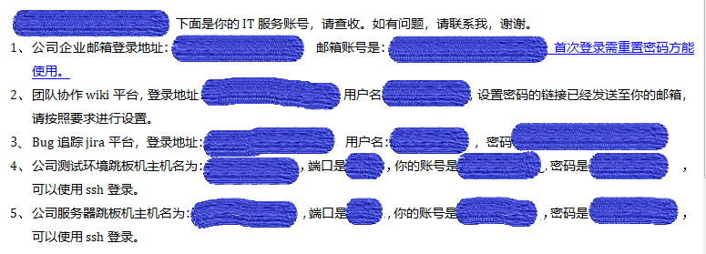
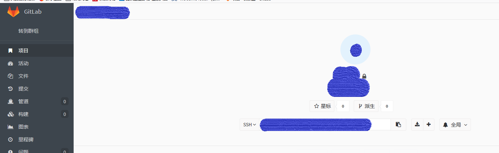
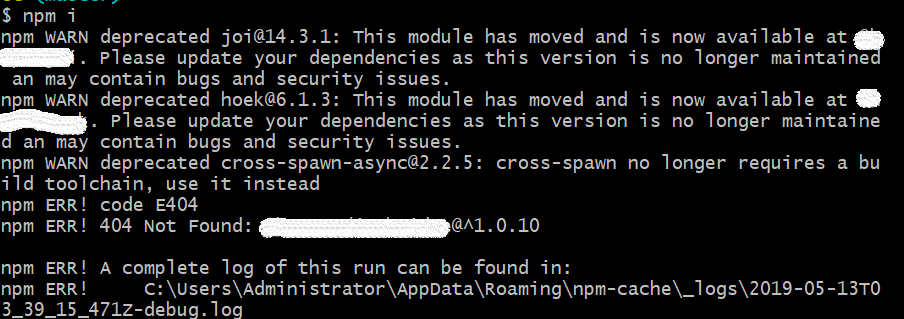
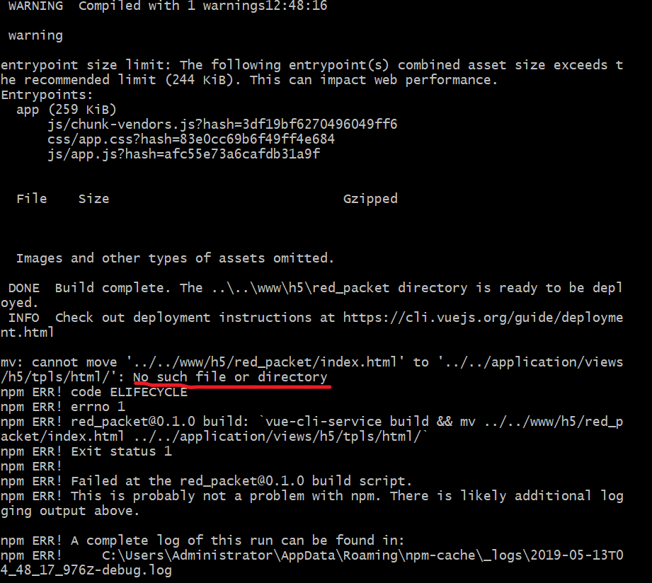
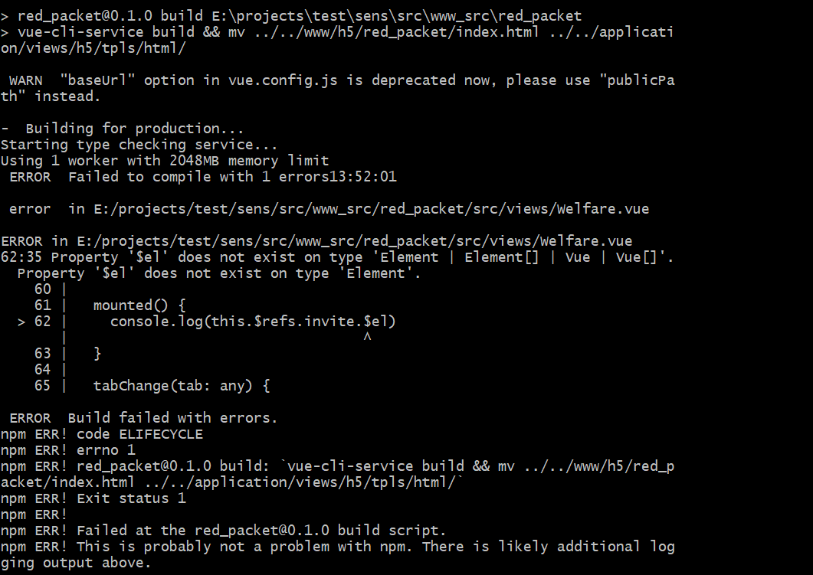

# 记录一下在公司的完整的开发流程

---

## 获取各个账号密码

在入职第一天会接收到来自IT部分的Email，其中包含了公司所要使用的各个系统的账号密码  

---

## 开发流程

- 注册gitLab账号，获取项目源码  
    公司的项目都会放在gitLab上面，通过管理员设置分组还获得权限，从而可以在改平台上拉取所需要的项目源码到本地(`git clone [url]`)。 **为了不要污染master分支上的代码，拉取完成后请建立自己的分支**  
    

- 完成项目代码的编写  
  - 查看项目代码  
      首先查看 *package.json*文件(不一定在项目根目录下，具体看项目文件)，了解项目相关依赖项以及各个命令( 如`npm run dev`等等 )
  - 安装相关依赖使用命令 `npm install`  
    - 安装bug: 在安装过程中，可能会因为npm镜像资源慢，或者使用公司自定义的npm包导致安装失败，如下图  
        
      - 解决方法：
        - 安装 [nrm](https://github.com/Pana/nrm)，`npm install -g nrm`，这是一个包管理工具。
  - 查看修改结果  
        如果是vue文件，在 *package.json*中查看项目启动命令如 `npm run serve`，来确定本地是否修改成功
  - 本地打包  
        如果是vue文件，在 *package.json*中查看项目命令如 `npm run build`，来打包本地文件。打包错误  
        1.   
        **创建目录:"../../application/views/h5/tpls/html/"**
        2.   
        **待解决**

    在这个过程中，注意查看package.json(项目的启动命令，项目的相关依赖项都在里面)。 **使用`npm install`将相关的包安装上**；在安装包的过程中，可能遇到安装失败的情况。可以使用 [**nrm**](tools/nrm.md)来管理安装源，将公司的安装源以及淘宝(cnpm)源进行管理。然后先安装公司自定义的包，然后在安装淘宝镜像。  
    在安装的过程中，如果失败，可以考虑把自动生成的 *package-lock.json文件*以及 *node_module文件夹*删除后，在进行重新安装包。

- 将项目代码放至测试环境下测试
  - 使用 [xshell](https://www.netsarang.com/zh/xshell/)来链接对应的服务器(使用 `ssh [url]` 可以跳转的另外的服务器上)。
  - 在服务器上切换到对应项目的目录下
  - 使用命令 `rz -bye` 来上传覆盖修改后所打包的文件。打包后的文件一般是在目录 *application*下，静态文件(如css或者js等)则在 *www*下。
  - 查看修改项目的代码所在的测试环境的服务器ip；使用[SwitchHosts](http://oldj.github.io/SwitchHosts/)来将 [host](计算机网络/hosts.md) 切换至对应的服务器。
  - 浏览器打开对应项目路径，查看是否修改正确。
  - 除了覆盖打包后的文件，也可以覆盖修改后的源码，然后在服务器上打包。打包过程和本地一样。

- 测试成功后试用Arcanist提交CodeReview
  - 在测试环境下通过后，在本地的git使用 `commit`命令进行提交
  - 使用 `arc which`可以查看本次提交CR所要做的对比，使用 `arc diff`来提交CR
    - 在新手项目中，如果没有建立 *.gitignore*直接进行CR提交的话，会报错，原因是提交的代码太大。解决: **建立 `.gitignore`来忽略不需要提交的文件代码**
    - 在一次提交后，如果代码没有过，然后又重复提交会报错。解决：[arc错误](tools/arc)
    - 一定注意不要使用目录名字不要使用中文

- CR通过后将代码push到远程服务器上
    CodeReview通过后，使用 `arc land --onto [branch]`或者 `git commit --amend`和 `git push`来将修改后的代码提交到远程服务器上

- 在预发环境下测试代码
  - 连接gateway服务器
  - 输入命令 `sudo su - duser`， `goslave`， `go [where]` 来跳转服务器
  - 找到自己项目的目录，**查看分支，切换分支**， 拉取远程服务器的代码。
  - 线上测试

- 上线
  - 使用 `npm run upload-cdn`将资源上次到cdn
  - 使用`env ENV_ONLINE=online sh deploy/deploy.sh src/application/views/h5/tpls/html/index.html`将html文件上线即可
